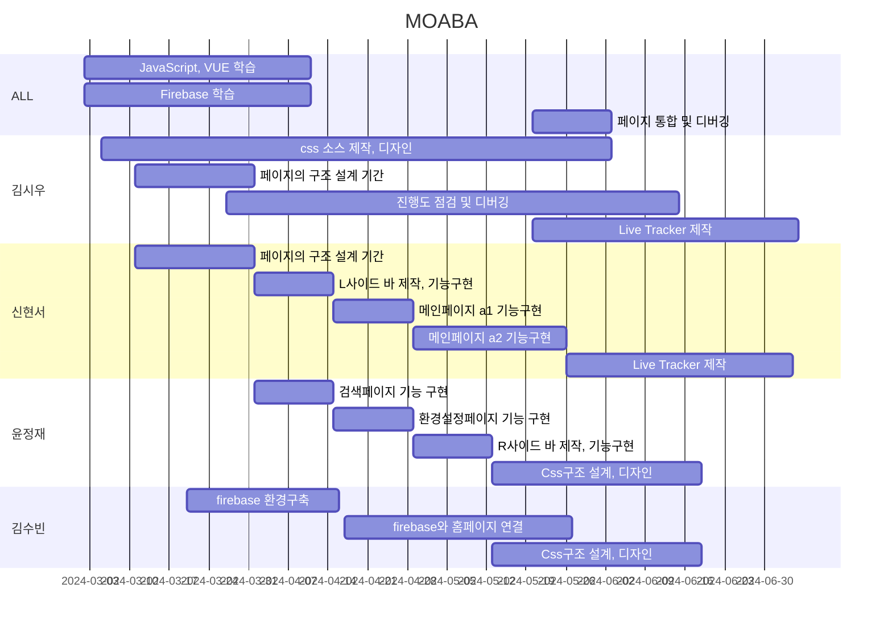

- 👋 Hi, I’m @kimsiwoo12
-  this github is only for a project of Hanseo Univ.

# current project
### 방송인 통합 정보 제공 플렛폼(MOABA_)

```mermaid
gantt
    title MOABA
    dateFormat  YYYY-MM-DD

    section ALL
    JavaScript, VUE 학습     :a1, 2024-03-02, 40d
    Firebase 학습            :a2, 2024-03-02, 40d
    페이지 통합 및 디버깅    :a3, 2024-05-20, 14d

    section 김시우
    css 소스 제작, 디자인    :a1, 2024-03-05, 90d
    페이지의 구조 설계 기간  :a2, 2024-03-11, 21d
    진행도 점검 및 디버깅    :a3, 2024-03-27, 80d
    Live Tracker 제작        :a4, 2024-05-20, 47d

    section 신현서
    페이지의 구조 설계 기간     :a1, 2024-03-11, 21d
    L사이드 바 제작, 기능구현   :a2, 2024-04-01, 14d
    메인페이지 a1 기능구현      :a3, 2024-04-15, 14d
    메인페이지 a2 기능구현      :a4, 2024-04-29, 27d
    Live Tracker 제작           :a5, 2024-05-26, 40d

    section 윤정재
    검색페이지 기능 구현          :a1, 2024-04-01, 14d
    환경설정페이지 기능 구현      :a2, 2024-04-15, 14d
    R사이드 바 제작, 기능구현     :a3, 2024-04-29, 14d
    Css구조 설계, 디자인          :a4, 2024-05-13, 37d

    section 김수빈
    firebase 환경구축        :a1, 2024-03-20, 27d
    firebase와 홈페이지 연결 :a2, 2024-04-17, 40d
    Css구조 설계, 디자인     :a3, 2024-05-13, 37d
```
